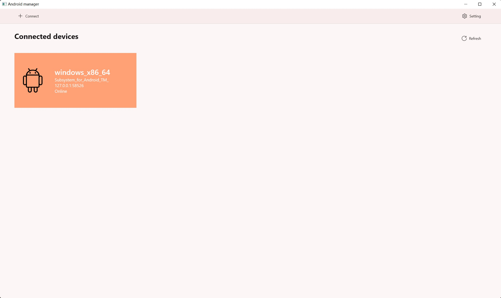
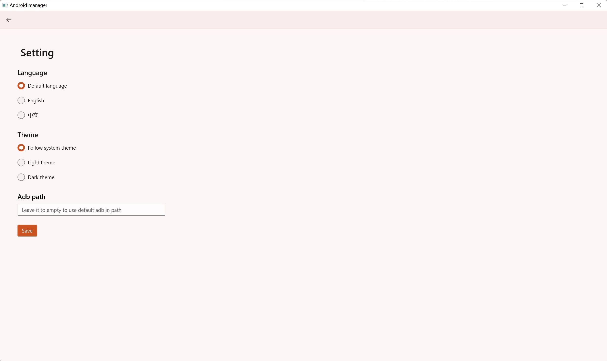
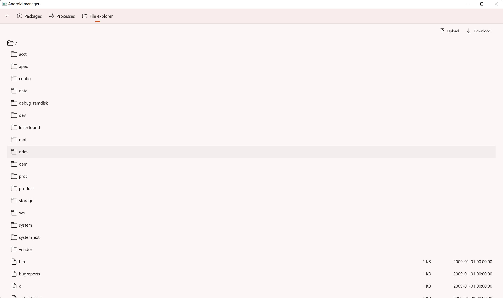

# Android manager

A client for you to manage your android devices and monitors. 

It's built on top of WinUI 3.

You can

- Manage your packages or install third party packages

- Monitor the processes running status

- Sync files between desktop and Android monitor

- ...

## Runtime screenshots

## TODO

[ ] Install and uninstall packages

[ ] Start and stop services

[ ] Upload and download files

